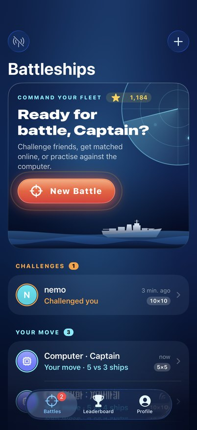
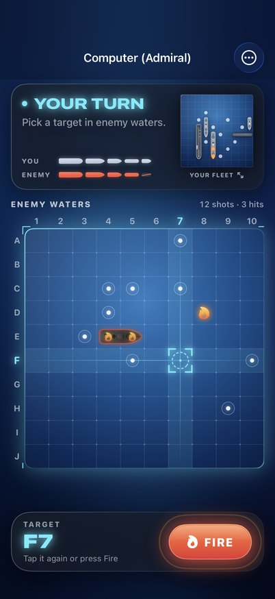
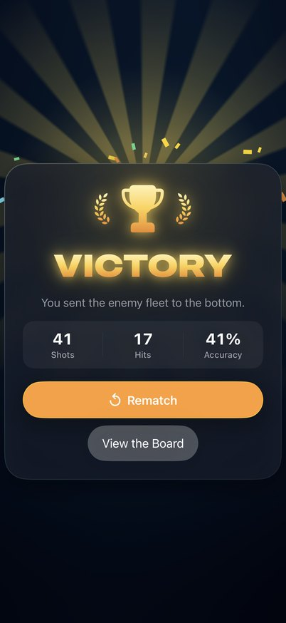
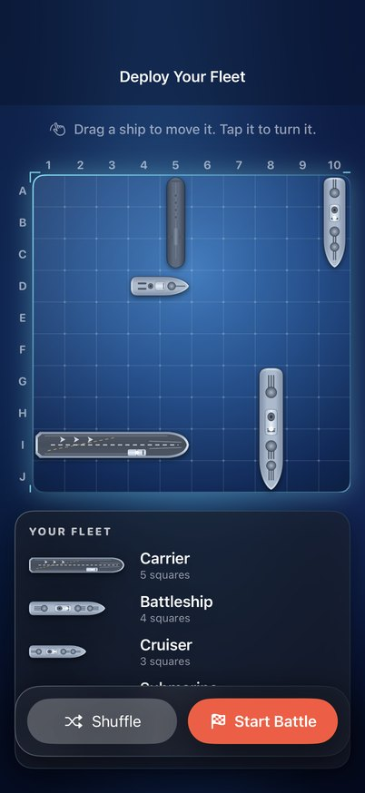
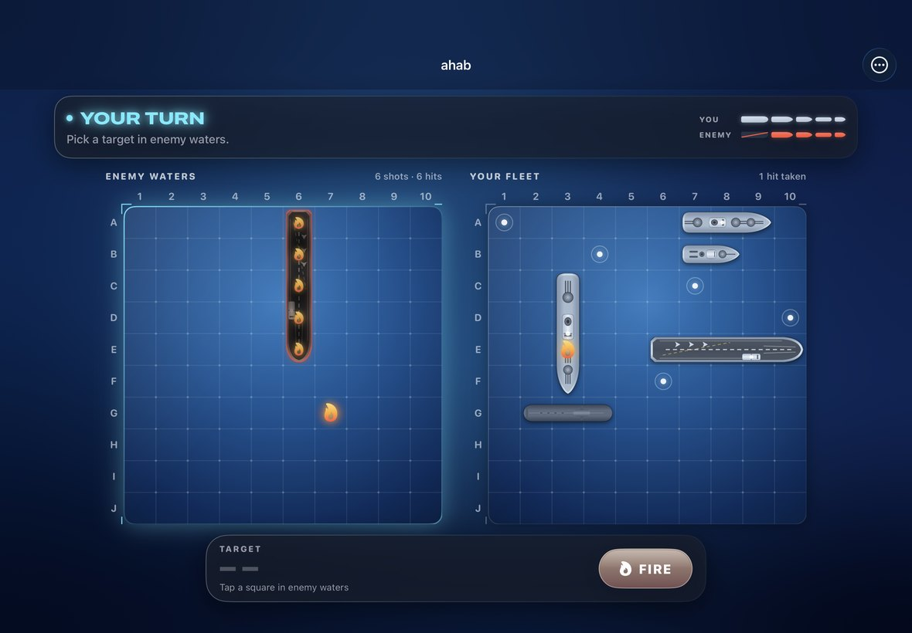

# Battleships

A native iOS Battleships game with its own backend, written in Swift end to end.

- **`iOSApp/`**: the SwiftUI app. Play the computer offline, get matched with a random opponent, or challenge a friend by username. Live updates, push notifications, a leaderboard, and full VoiceOver support. Battles are played on an animated sea: every class of ship is drawn in detail, shells explode or splash where they land, and the sound effects are synthesised in code.
- **`Server/`**: the backend, built from scratch on [Vapor](https://vapor.codes). Accounts, matchmaking, challenges, server-enforced rules, Elo ratings, WebSocket events and optional Apple push notifications. Runs on SQLite or Postgres.
- **`BattleshipKit/`**: a Swift package shared by both. It holds the game engine, the computer opponents, the JSON wire format and the networking client. Because the app and server compile against the same types, their API can't drift apart.

<p align="center">
  
  
  
  
</p>
<p align="center">
  
</p>

> The original Flutter client (`lib/`, `android/`, `ios/`, `web/`, …) is still at the repository root. It talks to the old CS 442 course server and isn't used by the new app.

## The game

| Mode | Board | Fleet |
| --- | --- | --- |
| **Classic** | 10×10 | Carrier (5), Battleship (4), Cruiser (3), Submarine (3), Destroyer (2) |
| **Quick** | 5×5 | Five single-cell patrol boats: the original Battleships rules |

Players alternate single shots. A ship sinks when every square of it has been hit, and its position is then revealed. Sink the whole enemy fleet to win. Ships may touch but not overlap. Online, each move has a time limit (three days by default); if a player lets it run out, their opponent can claim the win.

Against the computer you choose a difficulty:

| Level | How it plays | Average shots to sink a classic fleet* |
| --- | --- | --- |
| Cadet | Fires at random | 96 |
| Captain | Hunts on a checkerboard; after a hit, works along the ship until it sinks | 51 |
| Admiral | Counts every position the remaining ships could still be in and fires at the likeliest square | 45 |

<sub>*Averaged over 2,000 simulated games. The test suite checks the ordering: `BattleshipKit/Tests/BattleshipCoreTests/ComputerOpponentTests.swift`.</sub>

## Running it

You need **Xcode 16 or later** (Xcode 26 recommended) for the app. The server and shared package also build on Linux with Swift 6.

### 1. Start the server

```sh
swift run --package-path Server BattleshipServer serve
# Server started on http://127.0.0.1:8080
```

This creates `battleships.sqlite` in the current directory. To use Docker instead:

```sh
docker compose -f Server/docker-compose.yml up --build
```

### 2. Run the app

1. Open `iOSApp/Battleships.xcodeproj`.
2. Pick the **Battleships** scheme and an iPhone simulator, then **Run**.

Debug builds talk to `http://localhost:8080`, which the simulator shares with your Mac. Games against the computer need no server at all.

**On a real iPhone:**

1. Select your team under *Signing & Capabilities*, and change the bundle identifier if Xcode asks.
2. Point the app at your Mac using its Bonjour name: *Profile → Settings → Server → `http://your-mac-name.local:8080`*.
3. Start the server listening on the network: `swift run --package-path Server BattleshipServer serve --hostname 0.0.0.0`.

Release builds default to the URL in `iOSApp/Config/Battleships.xcconfig` (`API_BASE_URL`). Set it to your deployed server, which must use HTTPS.

## Deploying the server

The server is a single binary (or a small Docker image) configured entirely with environment variables.

| Variable | Default | Purpose |
| --- | --- | --- |
| `PORT` | `8080` | Port to listen on. Most hosting platforms set this for you. |
| `DATABASE_URL` | *unset* | A `postgres://` URL. When set, Postgres is used instead of SQLite. |
| `SQLITE_PATH` | `battleships.sqlite` | SQLite database file when `DATABASE_URL` isn't set. In Docker: `/app/data/battleships.sqlite` (a volume). |
| `LOG_LEVEL` | `info` | `trace`, `debug`, `info`, `notice`, `warning`, `error` or `critical`. |
| `AUTH_RATE_LIMIT_PER_MINUTE` | `20` | Sign-in and registration attempts allowed per IP per minute. |
| `MAX_OPEN_GAMES` | `20` | Games a player can have in progress or waiting at once. |
| `TURN_TIME_LIMIT_HOURS` | `72` | How long a player has to move before their opponent can claim the win. |
| `APNS_KEY_ID`, `APNS_TEAM_ID`, `APNS_TOPIC`, `APNS_PRIVATE_KEY` (or `APNS_PRIVATE_KEY_PATH`) | *unset* | Push notifications; see below. |

Database migrations run automatically on start-up.

**Docker on any server:**

```sh
docker build -f Server/Dockerfile -t battleships-server .     # from the repository root
docker run -d -p 8080:8080 -v battleships-data:/app/data battleships-server
```

**Fly.io, Render, Railway and similar** all build straight from `Server/Dockerfile` (set the build context to the repository root). Give the service a persistent volume mounted at `/app/data`, or attach a managed Postgres database and set `DATABASE_URL`. These platforms terminate HTTPS for you; on your own machine, put Caddy or nginx in front.

The server keeps WebSocket connections in memory and serializes game moves within the process, so run **one instance**. That comfortably handles thousands of players.

### Push notifications

Players get notified when it's their turn, when they're challenged, and when a game ends. To turn this on:

1. In your Apple Developer account, create an **APNs key** (*Certificates, Identifiers & Profiles → Keys*). Note the Key ID and your Team ID, and download the `.p8` file.
2. Give the server `APNS_KEY_ID`, `APNS_TEAM_ID`, `APNS_TOPIC` (the app's bundle identifier) and the key: either `APNS_PRIVATE_KEY` (the file's contents; `\n` escapes are fine) or `APNS_PRIVATE_KEY_PATH`.
3. In Xcode, add the **Push Notifications** capability to the Battleships target.

Push is off by default because free (personal team) developer accounts can't use it. Everything else works without it, and games still update live over WebSocket while the app is open.

## The API

All endpoints are JSON under `/v1`. Authenticated ones need `Authorization: Bearer <token>`. Errors look like `{"code": "not_your_turn", "message": "It's not your turn."}`. The Swift types for every request and response live in `BattleshipKit/Sources/BattleshipAPI`.

| Method | Path | |
| --- | --- | --- |
| `POST` | `/v1/auth/register` | Create an account → `{token, account}` |
| `POST` | `/v1/auth/login` | Sign in → `{token, account}` |
| `POST` | `/v1/auth/logout` | Revoke this session |
| `GET` | `/v1/me` | Your account and stats |
| `DELETE` | `/v1/me` | Delete your account (battles in progress are resigned) |
| `GET` | `/v1/players?prefix=` | Find players to challenge |
| `GET` | `/v1/leaderboard` | Top 50 by rating |
| `GET` | `/v1/games` | Your unfinished games and recent results |
| `POST` | `/v1/games` | `{mode, fleet, opponent?}`: challenge `opponent`, or join matchmaking |
| `GET` | `/v1/games/:id` | One game, from your side (enemy ships hidden until sunk) |
| `POST` | `/v1/games/:id/accept` | Accept a challenge with your fleet |
| `POST` | `/v1/games/:id/decline` | Decline a challenge |
| `POST` | `/v1/games/:id/cancel` | Withdraw a game that hasn't started |
| `POST` | `/v1/games/:id/shots` | `{target: "B7"}` → `{move, game}` |
| `POST` | `/v1/games/:id/resign` | Resign |
| `POST` | `/v1/games/:id/claim-victory` | Win a game whose opponent let their turn time run out |
| `POST` | `/v1/devices` | Register an APNs device token |
| `DELETE` | `/v1/devices/:token` | Unregister it |
| `GET` | `/v1/events` | WebSocket of `hello`, `gameUpdated` and `gameRemoved` events |
| `GET` | `/health` | Health check |

Coordinates are written like the board: a row letter and a column number, e.g. `"A1"` or `"J10"`.

## Development

```sh
swift test --package-path BattleshipKit    # engine, AI, wire format, client
swift test --package-path Server           # server, incl. end-to-end games through the app's client
xcodebuild test -project iOSApp/Battleships.xcodeproj -scheme Battleships \
  -destination 'platform=iOS Simulator,name=iPhone 17'
```

GitHub Actions runs all of this on every push (`.github/workflows/ci.yml`): the shared package and server tests on Linux and macOS, the app's build and unit tests on an iOS simulator, and a Docker build of the server with a smoke test. The app job also renders the main screens to PNGs (`BattleshipsTests/ScreenshotTests.swift`) and uploads them as the `screenshots` artifact.

How the code is organised:

- **`BattleshipKit/Sources/BattleshipCore`**: rules, fleets, the `Battle` state machine (it replays and verifies stored moves), `BattlePerspective` (one player's redacted view, which both boards are drawn from), and the computer opponents.
- **`BattleshipKit/Sources/BattleshipAPI`** and **`BattleshipClient`**: the wire format, plus `APIClient` (REST) and `RealtimeClient` (WebSocket that reconnects with backoff).
- **`Server/Sources/BattleshipServer`**: `GameService` holds the game logic. Every write goes through one async lock, so two requests can't act on the same game or grab the same matchmaking opponent.
- **`iOSApp/Battleships/Model`**: app state with no UIKit or SwiftUI imports (stores, `BattleController`, fleet placement). It's unit tested in `iOSApp/BattleshipsTests`.
- **`iOSApp/Battleships/Views`**: SwiftUI. Ships, explosions and the sea are drawn with `Canvas`; looping effects run off a `TimelineView` and hold still when Reduce Motion is on. Liquid Glass is used on iOS 26, with materials as the fallback on iOS 17 and later.
- **`iOSApp/Battleships/Model/SoundSynthesis.swift`**: the sound effects, generated as samples at launch (so there are no audio files) and played through `AVAudioEngine` with the ambient session, which respects the silent switch.

To regenerate the app icon: `python3 iOSApp/Tools/make_app_icon.py iOSApp/Battleships/Resources/Assets.xcassets/AppIcon.appiconset/AppIcon.png` (needs Pillow).

## Before submitting to the App Store

- Set your bundle identifier, team and the release `API_BASE_URL` (HTTPS).
- Enable push (above) if you want it.
- Accounts can be deleted inside the app (*Profile → Delete Account*), as App Review requires.
- The app makes no tracking requests and uses only standard encryption (`ITSAppUsesNonExemptEncryption` is already `NO`).
